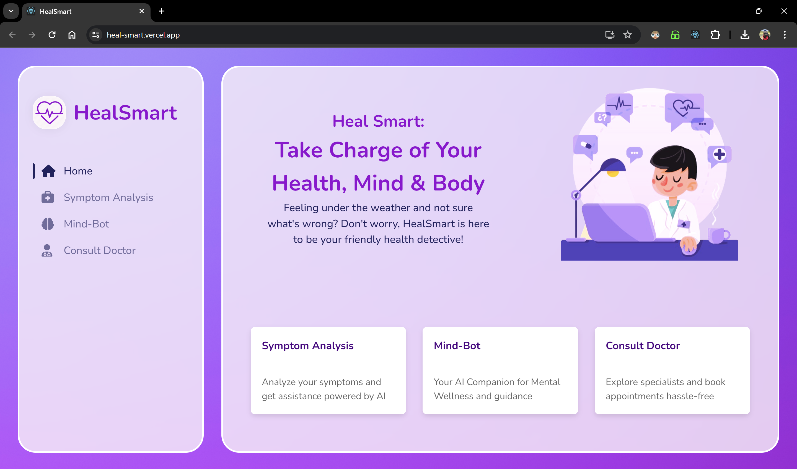
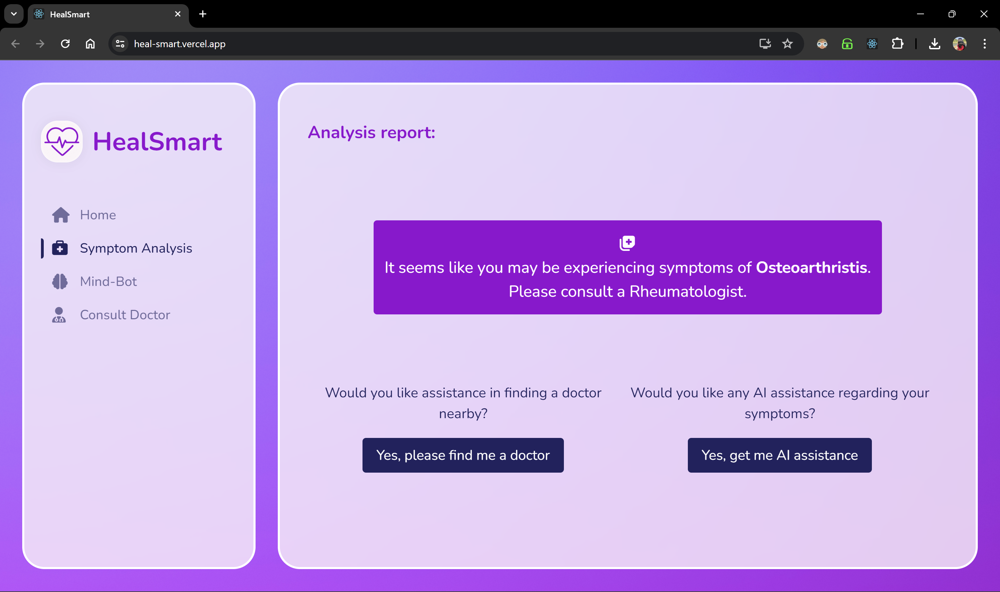
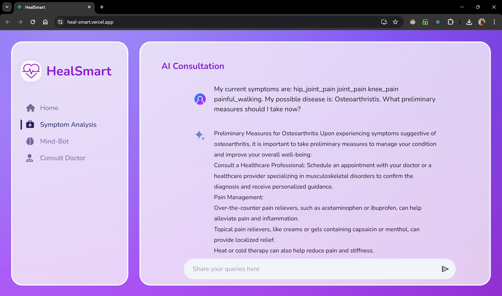
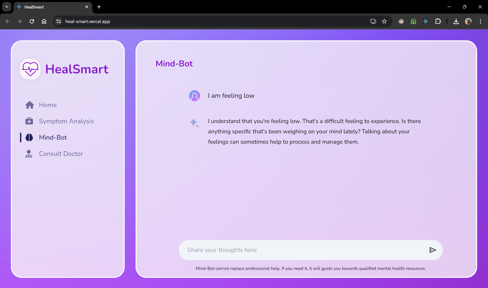
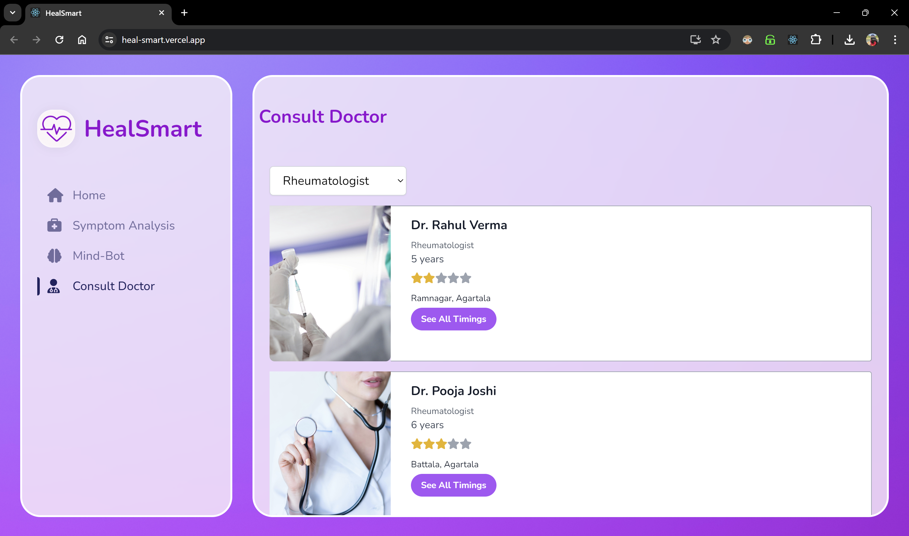

# HealSmart: A Medical Assistant

  <br>
  <p align="center">
    
  </p>


Welcome to HealSmart, an AI-powered medical assistant web app. The mission is to provide personalised healthcare recommendations, connect users with specialists, and offer mental health support. Leveraging advanced technologies like Machine Learning and Generative AI, my goal is to empower individuals to make informed healthcare decisions and enhance their well-being.


## Web App Link

**Click [here](https://heal-smart.vercel.app/) to visit the web app.**


## Key Features

<br>
<p align="center">
    
</p>


- **Symptom Analysis:** Predict diseases from symptoms using ML model, guiding users to specialist doctors and offering AI-driven recommendations.


- **Mind-Bot:** Provide empathetic mental health support through friendly conversations, addressing loneliness and stress with sensitivity using GenAI.
 
- **Consult Doctor:** Streamline finding and booking appointments with specialists, offering user-friendly interfaces and utilising Firebase for healthcare provider databases.
 
- **Intuitive Design:** Ensure a seamless and intuitive design for easy navigation and interaction, enhancing the overall user experience.


- **Enhanced Accessibility:**  Access healthcare recommendations and mental health support anytime, anywhere, through both web and mobile platforms.


- **Personalised Recommendations:** Tailor healthcare suggestions based on symptom analysis and user ratings, ensuring efficient and effective care.


## Demo


### Screenshots
<div align="center">
    
    
</div>
<div align="center">
    
    
</div>
<div align="center">
    
    
</div>
<div align="center">
    
    
</div>


## Technologies Used
- **Frontend:** React JS, HTML, Styled Components, Tailwind CSS
- **Backend:** Python (Flask)
- **ML Algorithm:** Logistic Regression
- **ML Libraries:** pandas, numpy, scikit-learn
- **APIs:** Gemini API
- **Database:** Firebase Firestore
- **Tools:** Google Collab, Google AI Studio, Postman, VS Code


## Design Idea & Approach


### Architecture
<p align="center">
    
</p>

HealSmart offers a comprehensive healthcare solution by leveraging modern technologies and user-friendly design principles. The architecture is built around three main divisions:

1. **Symptom Analysis:** HealSmart diagnoses diseases based on symptoms using a Flask API connected to a trained ML model. The predicted disease is received as a response from the API, and then it guides users to the appropriate specialist doctor for further consultation. Additionally, there's an AI-driven chatbot, developed using the Gemini API, which offers preliminary suggestions based on the symptoms and disease.
2. **Mind-Bot:** To address mental health concerns, I developed a chat application powered by the Gemini API from Google AI Studio. The Gemini 1.5 pro model is feeded with system instructions and trained with some conversations to provide empathetic consultations. This chatbot provides support for mental health issues like loneliness and anxiety and also offers suggestions on how to handle them effectively.

3. **Consult Doctor:** HealSmart enables users to find and book appointments with doctors across various specialties. Data is fetched from Firebase Firestore, where dummy healthcare provider datas are maintained. Users can explore doctors' profiles, view their basic details and ratings, and check for their availability. This feature streamlines the process of finding and scheduling appointments, enhancing the overall healthcare experience for users.


### Data Set Desciption

After searching online, I discovered a Kaggle dataset that fits our 'Symptom Analysis' recommendation system. The dataset comprises 133 columns: 132 for patient symptoms and 1 for prognosis. It covers 42 different diseases and illnesses. The 'training.csv' file contains a total of 4,920 rows.

### Machine Learning Lifecycle

<p align="center">
    
</p>

The machine learning lifecycle begins with exploratory data analysis (EDA). The dataset, consisting of 132 columns of categorical data (0 or 1), covered 42 diseases, each with 120 balanced samples. We ensured data consistency, corrected naming inconsistencies, and focused on 12 diseases for prototyping.

Utilizing techniques like Tree-based Algorithm for Feature Importance, Recursive Feature Elimination (RFE), and L1 Regularization (Lasso), I reduced features to 60 for simplicity. After excluding irrelevant rows and introducing a new class for uncorrelated symptoms, the dataset contained 1,560 rows and 61 columns.

I divided the dataset into X (60 columns) and Y (1 column) and applied an 80:20 train-test split, stratified to maintain equal class representation. Using Logistic Regression from sklearn, my model achieved a 99% validation accuracy, effectively addressing the multi-class classification problem.


## Getting Started


Click [here](https://heal-smart.vercel.app/) to visit the web app directly.

### Setting up the ML Model API locally

1. Make sure you have the following installed:
   - Python (version 3.x)
   - pip (Python package installer)
   - Virtual environment (optional but recommended)
2. Navigate to the `server` directory in the project.
3. Create a Python virtual environment using the command (optional):
   ```
   virtualenv venv
   ```
4. Activate the virtual environment (only if you have followed step 3):
   - On Unix/Linux:
     ```
     source venv/bin/activate
     ```
   - On Windows:
     ```
     venv\Scripts\activate
     ```
5. Install Python dependencies by running:
   ```
   pip install -r requirements.txt
   ```
6. Run the development server using:
   ```
   flask run
   ```
7. Access the API at `http://localhost:5000/predict`.
   - Method: POST
   - Content-Type: Application/JSON
   - Sample Body:
     ```json
     { "symptoms": ["hip_joint_pain", "joint_pain", "knee_pain", "painful_walking"]}
     ```
   - Sample Response:
     ```json
     {"prediction": "Osteoarthritis"}
     ```


### Running the HealSmart Web App Locally

1. Make sure you have the following installed:
   - NodeJS (LTS)
   - npm (Node package manager)
2. Clone this repository.
3. Navigate to the project directory.
4. Install dependencies by running:
   ```
   npm install
   ```
5. Navigate to the `frontend` directory and run again:
   ```
   npm install
   ```
6. Start the development server with:
   ```
   npm start
   ```
7. Access the web application at `http://localhost:3000` in your web browser.


## Use Cases

- **Symptom Analysis and Diagnosis:** Input symptoms to get potential diagnoses and find relevant specialist doctors.


- **Mental Health Support:** Engage in empathetic conversations for mental health guidance and professional help suggestions.


- **Doctor Consultation:** Find, view profiles, and proceed for booking healthcare providers.


- **Preventive Healthcare:** Receive timely recommendations for screenings, vaccinations, and lifestyle changes.


- **Disease Management:** Track symptoms and receive personalized recommendations for effective management.


- **Remote Healthcare Access:** Access healthcare guidance and support remotely without physical visits.


- **Post-Appointment Follow-up:** Track symptoms, medication adherence, and access support after appointments.


- **Healthcare Provider Collaboration:** Collaborate with healthcare providers for personalized recommendations and progress monitoring.


## Social Impact


- **Enhanced Accessibility:** Easier access to healthcare, reducing disparities.

- **Mental Health Support:** Destigmatizes issues, promotes help-seeking.
- **Improved Quality:** Personalized care, streamlined processes.
- **Preventive Care:** Promotes proactive health management.
- **Crisis Response:** Immediate support during emergencies.


## Scopes of Improvement


- **Enhance Symptom Analysis Accuracy:** Improve ML model accuracy and dataset comprehensiveness.
   
- **User Login:** Create an authentication system for users so that they can store their data always.
- **Integration of Telemedicine:** Facilitate virtual consultations for user convenience.
- **User Experience Refinement:** Gather feedback for intuitive interface enhancements.
- **Personalization and Customization:** Tailor content to individual preferences for better engagement.
- **Comprehensive Data Security:** Strengthen privacy measures for user trust and compliance.
- **Implement Proper Booking System:** Develop a robust booking system leveraging real healthcare database for streamlined appointment scheduling.


## References


- Link to Dataset: https://www.kaggle.com/datasets/kaushil268/disease-prediction-using-machine-learning
